<p align="center">
  
</p>

# Holdout

<p align="center">
  <a href="https://github.com/theofanis-tsakanikas/holdout/actions/workflows/ci.yml"></a>
  <a href="LICENSE"></a>
  
  
  <br>
  
  
  
  
  
  
  <br>
  
  
  
  
</p>

**A pricing system for a supermarket chain that proves whether its decisions made money — and, when the proof cannot stand, produces no number and a reason code.**
*Python · Databricks on AWS · Delta Lake · dbt · Spark · Terraform · GitHub OIDC · Amazon Bedrock*

---

## The problem

A retailer's pricing team reprices thousands of expiring fresh products every day, and once a
quarter somebody shows a slide that says the system delivered €4.2M. Nobody in the room can check
it. The number was computed against a "before" that was chosen after the fact, on stores that were
picked because they looked good, read out early because the first week looked promising, or on an
experiment that never had the power to detect what it claims. Every one of those makes the number
unfalsifiable, and an unfalsifiable number is worth exactly nothing to the person who has to act
on it.

Holdout takes the decisions and then refuses to state a result unless the comparison behind it is
valid: a share of the estate held back from the start and locked, a design that is checked for
power before a single unit is assigned, a readout that will not open before its declared end, and
four checks — balance, exposure, contamination, power — every one of which has to pass. Over 200
A/A draws it reports a "significant" effect **8 times, 4.0%, against a declared α of 5%**; where
the checks fail it reports the reason instead. **An uplift number produced without a valid holdout
is a build failure.** That is the project in one sentence.

## Status

**Everything in this repository is proved locally, and the estate has been built, driven and torn
down through CI four times.** The last full cycle ran on 2026-09-13, from `main`, every dispatch
verified against the account afterwards:

| step | run | what it did |
|---|---|---|
| `deploy` | [34756057061](https://github.com/theofanis-tsakanikas/holdout/actions/runs/34756057061) | four Terraform layers, 135 resources, in 5 minutes |
| `backfill` | [34756473276](https://github.com/theofanis-tsakanikas/holdout/actions/runs/34756473276) | 8 weeks of history, silver and gold, a model trained, gated, registered and served |
| `run` | [34758751989](https://github.com/theofanis-tsakanikas/holdout/actions/runs/34758751989) | a live day with late and duplicated deliveries; both experiments read out; the endpoint asked which version answered |
| `inspect` | [34759485334](https://github.com/theofanis-tsakanikas/holdout/actions/runs/34759485334) | every table counted, both dashboards' datasets executed, the assignment table's door tried, ten demo queries run |
| `destroy` | [34761519867](https://github.com/theofanis-tsakanikas/holdout/actions/runs/34761519867) | 138 resources and the workspace's network removed; the account asked what is left |

What `run` read out of `gold.readout` on the estate — one experiment sized correctly, one declared
with a stopping rule that permits peeking:

```
readouts       2
with a number  1   ['fresh-ladder']          +12,398 cents  [+11,223, +13,571]  p = 0.001
refused        1   [('fresh-ladder-peeking', 'STOPPING_RULE_PERMITS_PEEKING')]
OK      every figure this step publishes was asserted
```

And none of that is needed to check the thesis. The claim that separates this from a demo runs
on a laptop, with no account, in under five minutes:

<p align="center">
  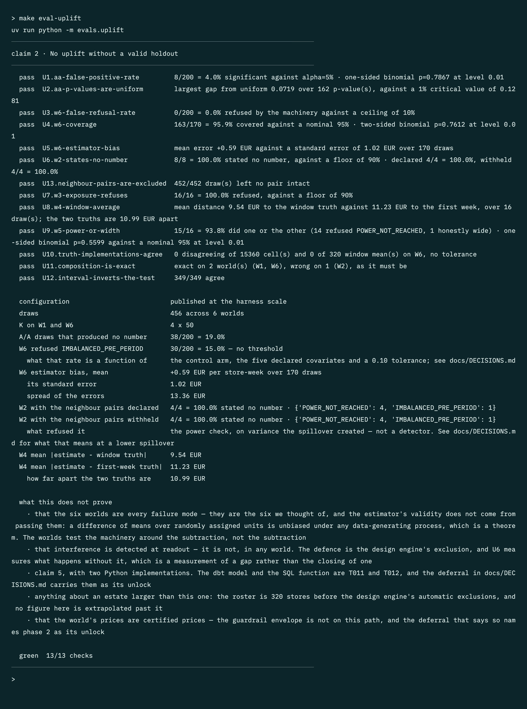<br>
  <sub><b>Claim 2, measured</b> — <code>U1</code> is the number the project rests on: over 200
  A/A draws, where both arms run the same policy and the true effect is zero by construction,
  the system reports a "significant" uplift <b>8 times, 4.0%</b>, tested as a one-sided binomial
  against α = 5%. Read the pair beside it: <code>U3</code>, the false-refusal rate on the world
  where the effect is real, is <b>0 of 200</b> — a system that refused everything would pass
  every other line here and be worthless. <code>U4</code> is interval coverage, 95.9% against a
  nominal 95%; <code>U10</code> is two separately written implementations of the truth agreeing
  on 15,360 cells with no tolerance. The block that ends the report, <i>what this does not
  prove</i>, is printed on every run.</sub>
</p>

**The estate is torn down.** It costs nothing while it is down, it is rebuilt from `main` by one
dispatch, and a torn-down estate that provably ran is worth more here than one left standing —
the whole argument of the project is that a number has to be reproducible from what was written
down.

<p align="center">
  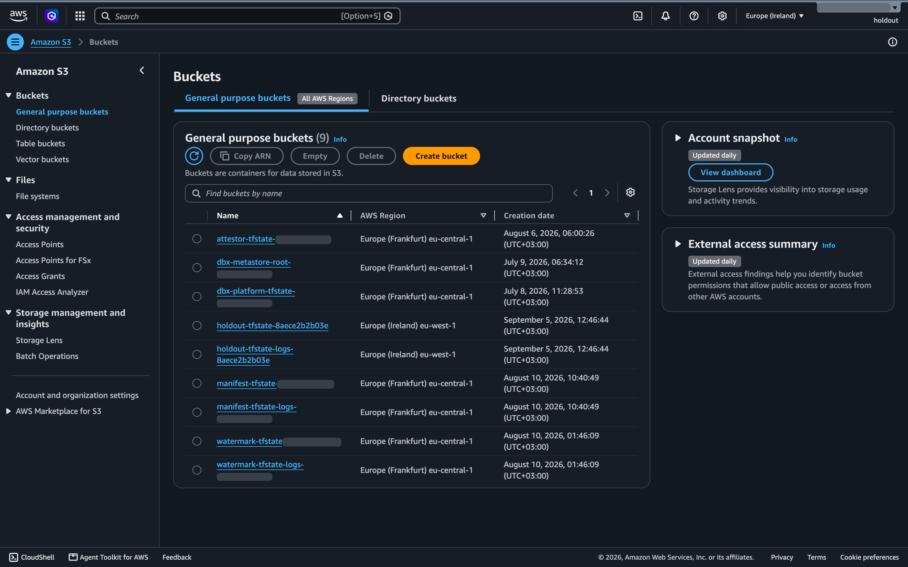<br>
  <sub><b>What survives a teardown</b> — the account's bucket list after <code>destroy all</code>:
  the Terraform state bucket and its access-log twin, in eu-west-1, and nothing else of this
  project's. The other seven belong to sibling projects and carry the account id in their names,
  which is why they are barred; the frame was taken by a headless browser signed in for fifteen
  minutes with read-only rights, and passed through <code>aws-mask</code> before it landed here.
  Screenshots of the two AI/BI dashboards are taken on the next cycle, the same way.</sub>
</p>

## Contents

- [The problem](#the-problem) · [Status](#status)
- [Architecture](#architecture)
- [The seven claims, and how each is attacked](#the-seven-claims-and-how-each-is-attacked)
- [The refusal is the product](#the-refusal-is-the-product)
- [The agent proposes and never approves](#the-agent-proposes-and-never-approves)
- [The gates are proved to bite](#the-gates-are-proved-to-bite)
- [Quickstart](#quickstart) · [Testing](#testing) · [Repository layout](#repository-layout)
- [What this does not do](#what-this-does-not-do) · [Cost](#cost) · [Decisions](#decisions)
- [Docs](#docs) · [Security](#security) · [License](#license)

---

## Architecture

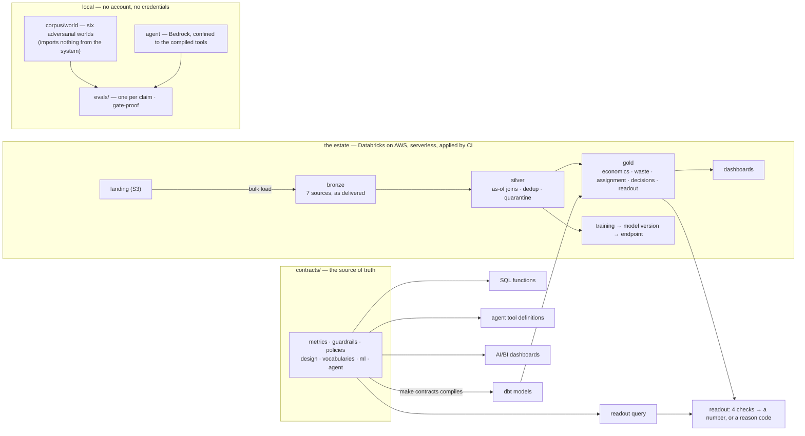

The boundary that matters is the one between the contract layer and everything else: a metric is
defined once, in YAML, and compiled into every consumer, so two consumers cannot disagree about
what margin means. The second boundary is between `corpus/world/` and `src/holdout/` — the
generator that produces the adversarial worlds imports nothing from the system it attacks, and a
test fails the build if it ever does. The third is the assignment table: written before the period
opens, from a committed seed, and append-only at the storage layer.

<p align="center">
  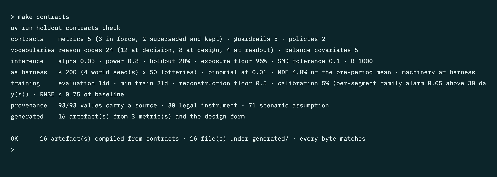<br>
  <sub><b>The contract layer compiling</b> — <code>make contracts</code> validates every contract,
  recompiles all sixteen consumers under <code>generated/</code> and compares them byte for byte,
  so a hand edit to a compiled artefact is a red run. <b>93 of 93</b> numbers carry a source — 30
  a legal instrument, 71 a declared scenario assumption — because a <code>value</code> without a
  <code>source</code> is a build failure here, whatever file extension it lives in.</sub>
</p>

---

## The seven claims, and how each is attacked

Every claim is a Makefile target, every target owns an eval and a set of planted mutations, and
CI runs every one of them on every push. The trap beside each claim is the way an eval could agree
with itself; the attack is what stops it.

| # | claim | attacked by | measured on `main` |
|---|---|---|---|
| 1 | No price reaches a shelf without the guardrail set | 32,480 price quotes the ONS collected in shops, not a planter reading the same contract | 0 violations in 28,482 certified prices · 0 disagreements in 824,790 bounds |
| 2 | On an A/A split the system reports an effect no more often than α | 200 seeds × six adversarial worlds, a design-based estimator, a generator behind an enforced import barrier | **8/200 = 4.0%** against α = 5%; W6 false-refusal rate 0/200 |
| 3 | The holdout is neither erased nor chosen after the fact | a committed seed, a seal, and a contamination check that reports every uncoordinated edit by name | 10/10 checks; on the estate, `delta.appendOnly` refuses the `DELETE` by name |
| 4 | A stock-out is never read as zero demand | days censored on purpose where the withheld total is known | 0 of 16,942 emptied store-days read as fully observed |
| 5 | One definition, three mechanisms, the same number | the compiled SQL executed by Spark against the Python path, as integers | 4/4 checks, no tolerance |
| 6 | The design engine refuses an invalid design whoever proposed it | a real model's 13 proposals graded live; peeking and post-hoc exclusions run anyway on the null world | N = 11 proposed, M = 8 refused; peeking is confidently wrong in 4 of 28 lotteries (14.3%) |
| 7 | A decision that targets a person is structurally impossible | 317 person-names from two published vocabularies against a closed field set | 0 of 244 fields is a name a person is known by |

The figures are the ones `make claim-N` prints; `make figures` re-runs the ones that appear in
prose and fails when they drift. Claim 2 is above, under *Status*; the other six, as their evals
print them:

<table>
<tr>
<td width="50%">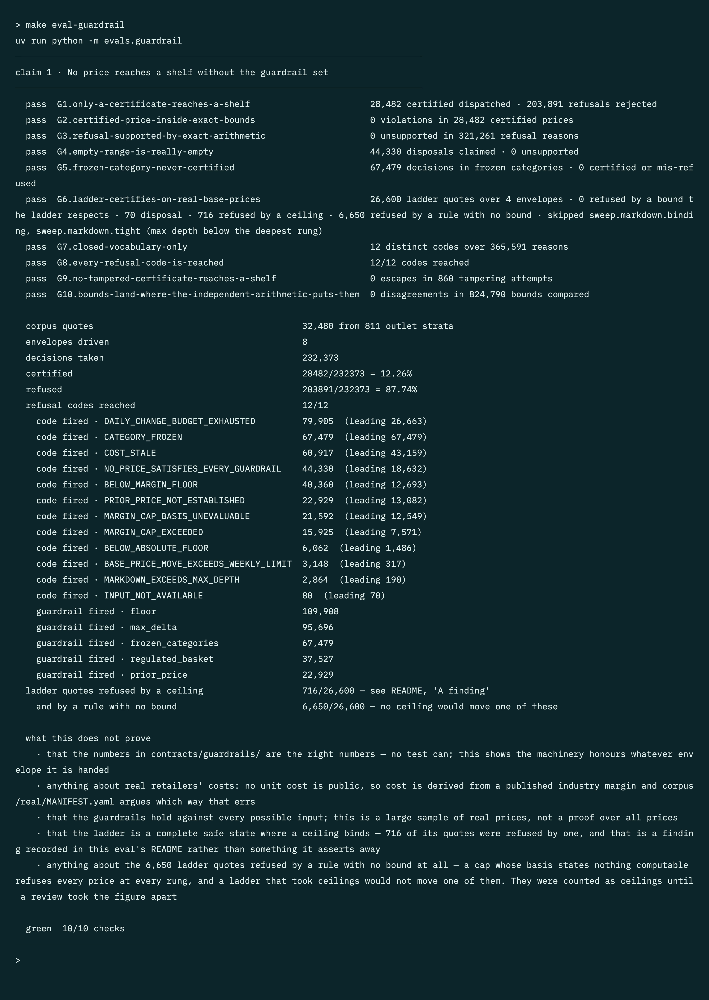<br><sub><b>Claim 1 — the envelope, attacked from outside</b>: 32,480 prices the ONS collected in shops, not a planter reading the same contract as the detector. <code>G2</code> is the claim, <b>0 violations in 28,482 certified prices</b>; <code>G10</code> compares the bounds themselves, 824,790 of them, against a second implementation written in exact decimal euros. The <b>716</b> ladder quotes refused by a ceiling are published as a number rather than asserted away — they are a finding about the doctrine's safe state, and the README's <i>Decisions</i> table carries it.</sub></td>
<td width="50%">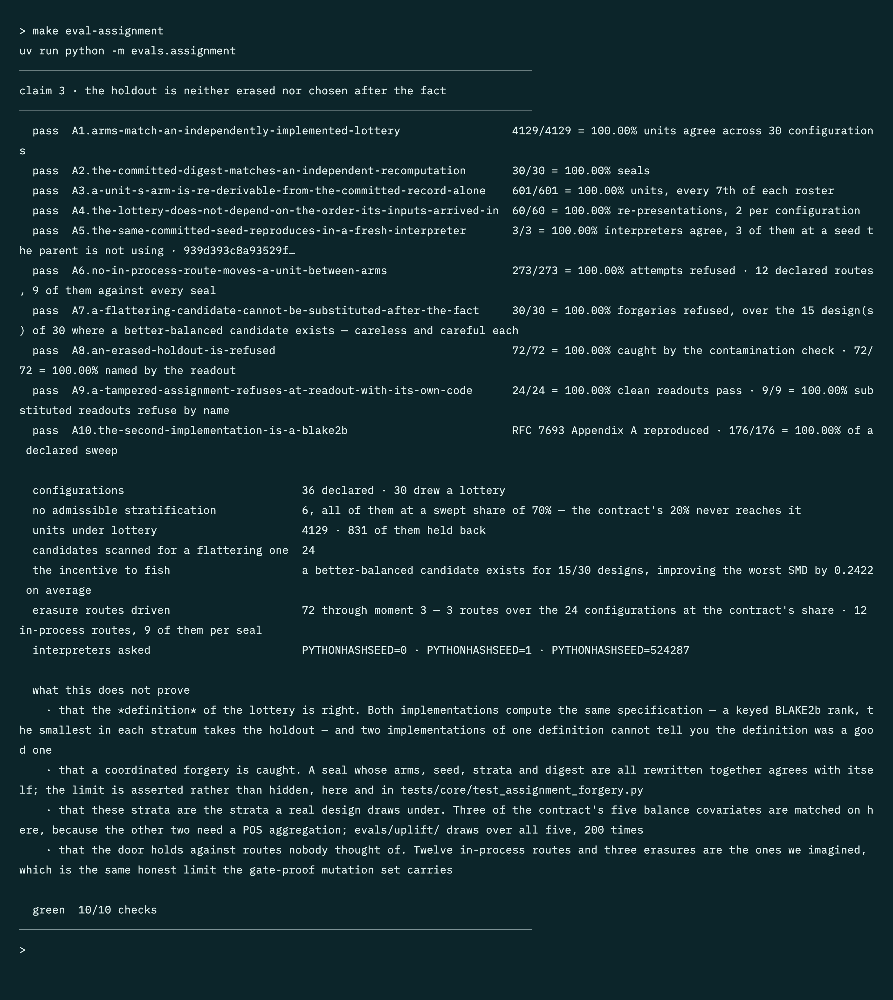<br><sub><b>Claim 3 — the holdout is neither erased nor chosen after the fact</b>: a keyed BLAKE2b lottery from a committed seed, reproduced by a second implementation that first proves itself against <b>RFC 7693</b>'s own test vectors (<code>A10</code>). <code>A6</code> drives twelve in-process routes to move a unit between arms, <b>273 of 273 refused</b>; <code>A7</code> scans for a better-balanced candidate after the draw — one exists for 15 of 30 designs — and <b>30 of 30</b> substitutions are refused. The limit is printed: a coordinated forgery of every field agrees with itself.</sub></td>
</tr>
<tr>
<td width="50%">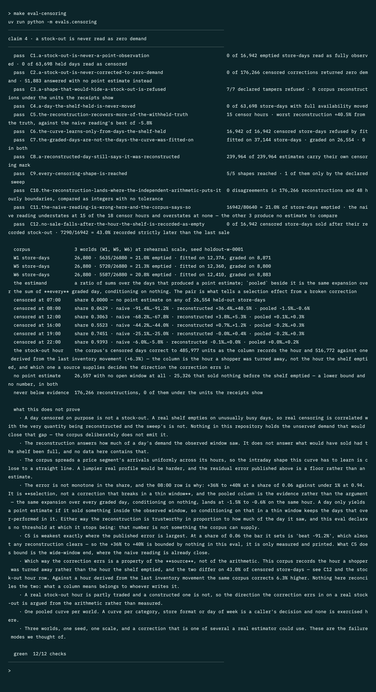<br><sub><b>Claim 4 — a stock-out is never read as zero demand</b>: <b>0 of 16,942</b> emptied store-days read as fully observed, and 0 of 176,266 corrections returned a zero — 51,883 answered with a lower bound and no number instead. The correction is graded on days censored <i>on purpose</i>, where the withheld total is known: at the first trading hour the naive reading understates demand by 91%, at the last by 6%. The table of the residual error by censor hour is printed so the weak end — a thin window at 08:00 — is visible rather than averaged away.</sub></td>
<td width="50%">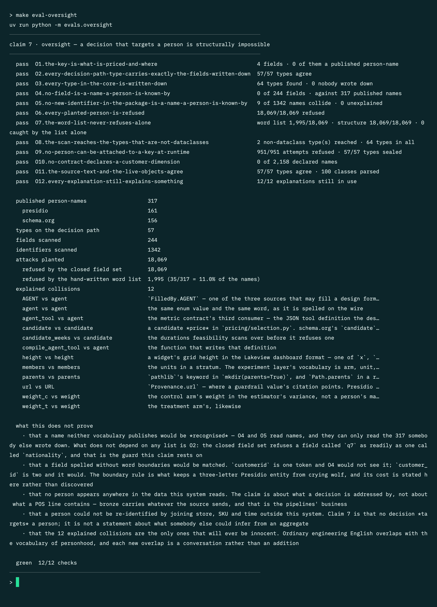<br><sub><b>Claim 7 — a decision that targets a person is structurally impossible</b>: the 317 names come from two publishers who have never read this repository (Presidio's entity types and schema.org's Person properties), and <b>0 of 244</b> fields on the decision path is one of them. The guard that holds is not the word list: <code>O7</code> shows the hand-written list catching <b>1,995 of 18,069</b> planted persons and the closed field set — which reads no names at all — refusing <b>18,069 of 18,069</b>.</sub></td>
</tr>
<tr>
<td width="50%">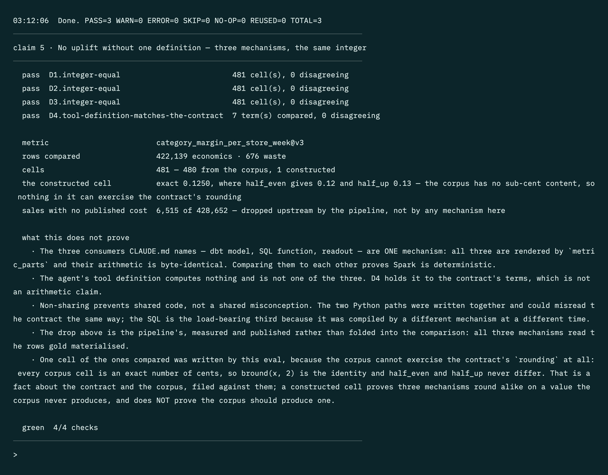<br><sub><b>Claim 5 — one definition, three mechanisms, the same integer</b>: dbt builds the compiled model (<code>Done. PASS=3</code>, the line above the report), Spark executes the compiled SQL, and the Python readout computes the same metric; <b>481 cells, 0 disagreeing</b>, compared as integers with no tolerance. One cell is constructed on purpose, because the corpus has no sub-cent content and could never exercise the contract's rounding — and the report says so rather than letting the 480 stand for 481.</sub></td>
<td width="50%">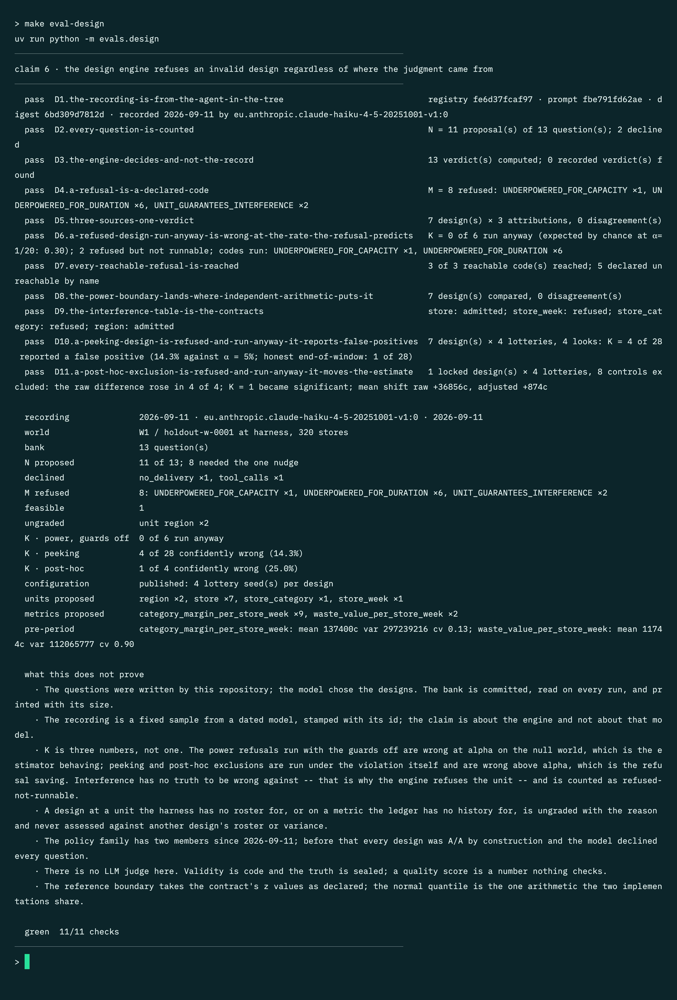<br><sub><b>Claim 6 — the design engine refuses an invalid design whoever proposed it</b>: a real model — Claude Haiku 4.5, through Amazon Bedrock — proposed <b>11</b> designs for 13 questions, and code refused <b>8</b> by name. <code>D10</code> runs the refused peeking design anyway on the null world: confidently wrong in <b>4 of 28</b> lotteries, 14.3% against α = 5%. <code>D11</code> runs a post-hoc exclusion anyway: the raw difference moves by 36,856 cents. No LLM judge rules on validity, and the recording is fingerprinted, so a prompt edited without re-recording is <code>STALE</code>.</sub></td>
</tr>
</table>

## The refusal is the product

The design engine sees a nine-field form — hypothesis, intervention, scope, metric, unit, minimum
detectable effect, duration, exclusions, decision rule — and answers one question at three moments:
*can this experiment exist*, *is it running as declared*, *may the result be stated*. The
vocabulary of refusals is closed, so a refusal can be counted, tested and gated:

```
at_design:   UNDERPOWERED_FOR_DURATION · UNDERPOWERED_FOR_CAPACITY · UNIT_GUARANTEES_INTERFERENCE ·
             STOPPING_RULE_PERMITS_PEEKING · EXCLUSIONS_DEFINED_POST_HOC · METRIC_NOT_IN_CONTRACT ·
             UNITS_ALREADY_COMMITTED · NO_ADMISSIBLE_ASSIGNMENT
at_readout:  IMBALANCED_PRE_PERIOD · EXPOSURE_BELOW_THRESHOLD · CONTAMINATED_ASSIGNMENT · POWER_NOT_REACHED
```

The first moment is where most of the refusing happens, and the number it is judged on is not
the store count. The engine drops one member of every pair of stores close enough to measure each
other's trade, and the lottery is drawn over what survives:

<p align="center">
  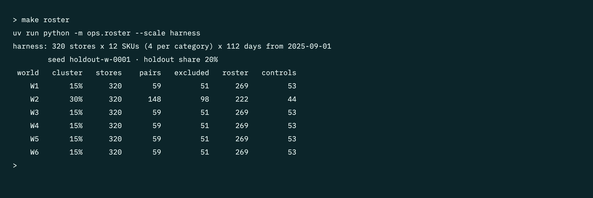<br>
  <sub><b>The roster, not the estate</b> — 320 stores is a bill; <b>269 with a control arm of 53</b>
  is the number a claim can be checked against. W2 is the world built so neighbours interfere:
  148 pairs, a roster of 222, and every one of its lotteries refused for power rather than
  estimated on contaminated units — the eval publishes that pair, with the pairs declared and
  with them withheld.</sub>
</p>

On the estate the two declared experiments are the demonstration: the same intervention, sized
correctly, produces a number with an interval; declared with four interim looks and no spending
function, it is refused at design and never assigned. The refused version of the readout screen
is the single most important image in the project, and the dashboard shows the refusal in the same
cell the number would occupy.

A finding worth reading before trusting the number above: for four days the estate refused *both*
experiments, and the refusal was accepted as the demonstration. It was a correct output of a wrong
input — the ERP's cost ledger had been exported once, on the last day of the history, so silver
knew every cost on that day and priced no earlier sale. A fresh-context review found it by reading
`known_from` against the export day; [`docs/FINDINGS.md`](docs/FINDINGS.md) carries it, and the
gate now requires both a number and a refusal so that it cannot pass on a bug again.

## The agent proposes and never approves

The second AI system is a language model — Claude Haiku 4.5, reached through Amazon Bedrock with
the account's own credentials and no second secret — that proposes experiment designs. It is
confined rather than trusted:

- it can call exactly the three tools the metric contract compiles to; a planted call to
  `run_sql` is refused by name, and the loop edited to bypass the registry turns a test red;
- two of the nine fields — `max_duration` and `decision_rule` — cannot be filled by it, because
  the proposal type has seven fields and nowhere to put them: *the agent proposes how we will
  find out, never what we will do once we know*;
- its recording is fingerprinted over the tool registry and the prompt, and the eval recomputes
  both — a prompt edited without re-recording is `STALE`, not green;
- validity is decided by code, the same code for a human, a declared policy or the agent, and a
  mutation that makes the engine trust a human more turns the eval red in 36 seconds.

No language model is anywhere near the decision path: too slow, too expensive at 2.4M decisions
a day, and non-deterministic.

## The gates are proved to bite

`make gate-proof` plants **59 mutations** across the seven claims — the margin floor rounding the
wrong way, a neighbour exclusion keeping both members of a pair, a sample size losing a z, a prompt
edited without re-recording — and requires each to be refused **by the check named in advance**.
A mutation caught by a different check proves nothing about the line it was aimed at and is
reported as `SURVIVED`; two did, in claim 1's history, and both are kept in the record. A mutation
that crashes the eval is not a mutation. The ledger refuses a claim target with nothing planted
against it.

<table>
<tr>
<td width="50%">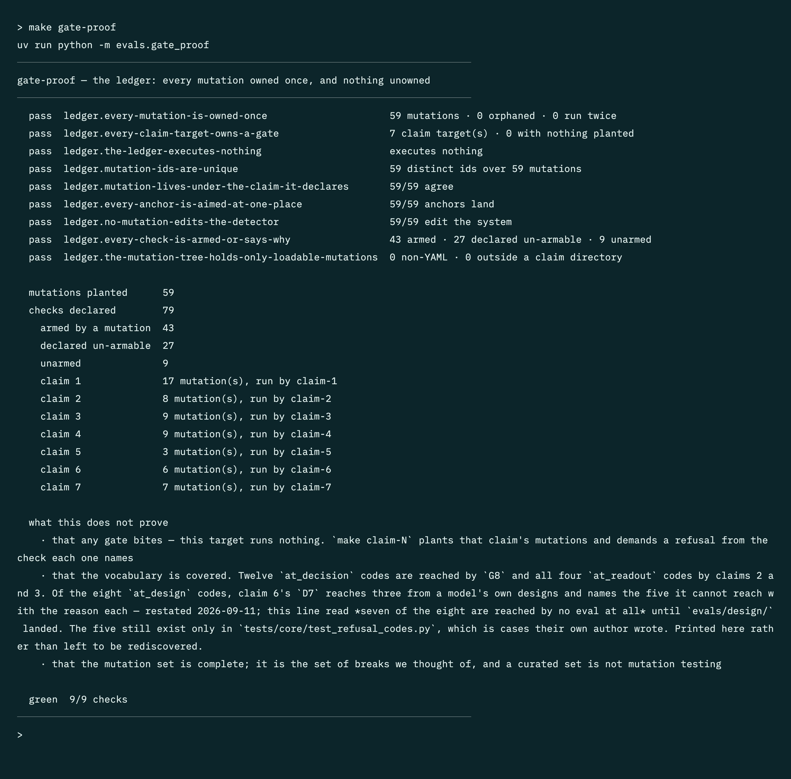<br><sub><b>The ledger</b> — <code>make gate-proof</code> runs no mutation; it is the accountant. <b>59</b> planted, each owned by exactly one claim target, none run twice; of 79 declared checks, <b>43</b> are armed by a mutation, 27 say why they cannot be, and <b>9</b> are unarmed and printed as such. The line <i>this target runs nothing</i> is in the frame on purpose.</sub></td>
<td width="50%">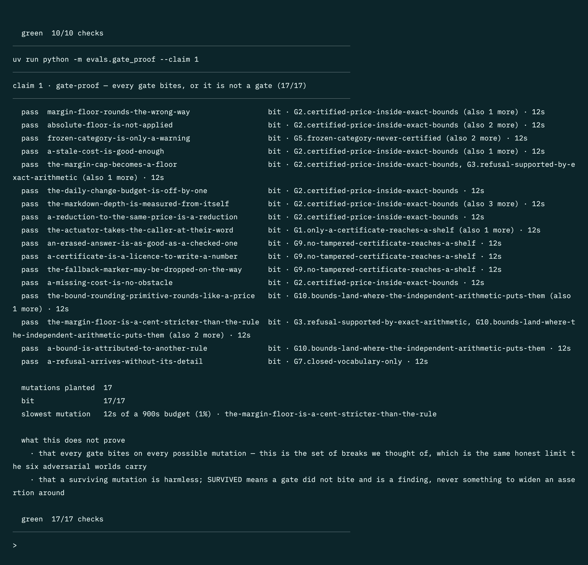<br><sub><b>A gate biting</b> — the second half of <code>make claim-1</code>: seventeen breaks planted one at a time in the guardrail code, each refused <b>by the check named in its YAML before anybody looked</b>. Read <code>a-bound-is-attributed-to-another-rule</code>: a bound at exactly the right amount wearing another rule's id moves no arithmetic, wrongly certifies no price, and is refused by <code>G10</code> and nothing else — which is what earns that check its place.</sub></td>
</tr>
</table>

The same rule is turned on the repository's own documents: `make findings` refuses a finding that
no longer anchors to the line it named, `make expiry` refuses a deferral with no unlock condition
and no date, `make figures` re-runs every figure that appears in prose, and `make language`
refuses Greek outside the declared exceptions in a repository whose author works in Greek.

The demo's queries — [`ops/demo_queries.sql`](ops/demo_queries.sql) — are one file read two ways:
`inspect` executes every block against the warehouse, and the lakehouse layer imports the same
file as a SQL notebook at `/Shared/holdout/demo`, one cell per block. What a viewer types is what
the last `inspect` measured.

---

## Quickstart

Requires Python 3.12, [`uv`](https://docs.astral.sh/uv/), `jq`, and Terraform for `make terraform`.
No cloud account is needed for anything below.

```bash
# 1. clone and install the local extras
git clone https://github.com/theofanis-tsakanikas/holdout.git && cd holdout
uv sync --extra contracts --extra agent

# 2. the whole local gate: lint, types, contracts, the four document gates, the suite
make check

# 3. one claim end to end — the eval, then the mutations planted against it
make claim-1

# 4. the one that separates this from a demo: 200 A/A draws over six worlds (minutes, cached)
uv sync --extra spark && make claim-2
```

The estate is reached only through the five dispatch workflows in
[`.github/workflows/`](.github/workflows/), from `main`, and each of them refuses a sha that `ci`
has not passed. Applying `infra/bootstrap` from a laptop, once, is the one manual step and is
written up in [`infra/bootstrap/README.md`](infra/bootstrap/README.md).

---

## Testing

**1,991 tests** — 1,925 in `make test` (one of them skips itself, by name, until a workflow
declares the read-only `plan` environment it is written for) plus 66 that need Spark and dbt
and run in their own CI bins (`silver`, `gold`, claim 2's tests) — cover the core, the contracts and their compilers, the
corpus barrier, the pipelines against local Delta, the agent against a scripted model, and the
repository's own gates. They deliberately do not touch a cloud account: the estate is exercised by
the dispatch workflows and asserted against the account, never by a test.

```bash
make check         # lint · typecheck · contracts · language · findings · expiry · figures · terraform · tests
make claim-N       # one claim's eval and its gate-proof mutations, N in 1..7
make gate-proof    # the mutation ledger: every claim target owns what is planted against it
```

<table>
<tr>
<td width="50%">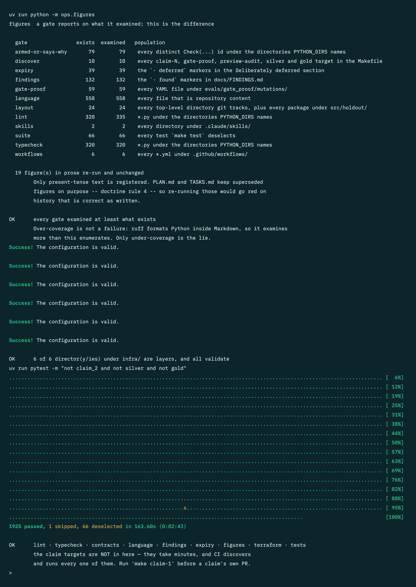<br><sub><b>The whole local gate</b> — nine checks in the order that fails fastest, ending in the suite; the four in the middle are the repository's gates on its own documents — findings that must still anchor, deferrals that must say how they end, figures that must still reproduce, no Greek outside the declared exceptions.</sub></td>
<td width="50%">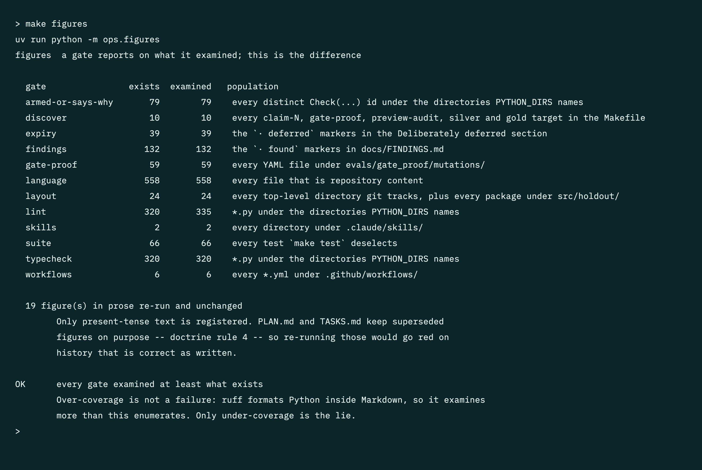<br><sub><b>The gate on the gates</b> — every gate declares how its population is enumerated, and <code>make figures</code> counts it a second way and compares: <b>red when a gate examined less than exists</b>, never when it examined more. It exists because a language check once reported zero from a <code>grep</code> flag BSD does not implement, and a claim-8 would once have been invisible to CI.</sub></td>
</tr>
</table>

CI ([`ci.yml`](.github/workflows/ci.yml)) discovers every `claim-N` target from the Makefile — a
target that exists but is never run is impossible by construction — packs them into bins sized
from measured runtimes, shards claim 2 seven ways, and requires one aggregate check on `main` that
fails on anything that is not `success`, including `skipped`. The count is from `make check` on 2026-09-15; CI's last run on `main` is
[34832024668](https://github.com/theofanis-tsakanikas/holdout/actions/runs/34832024668).

---

## Repository layout

| Path | Purpose |
|---|---|
| [`contracts/`](contracts/) | the source of truth: metrics, guardrails with effective windows, policies, the design form, the closed refusal vocabulary, training, the agent's ceilings |
| [`generated/`](generated/) | what the compilers emit — byte-compared on every run, never hand-edited |
| [`src/holdout/core/`](src/holdout/core/) | pure functions over plain data: guardrails, the ladder, the design engine, assignment, the four checks, the estimator, the censoring correction |
| [`src/holdout/contracts/`](src/holdout/contracts/) | the loader and the compilers |
| [`src/holdout/agent/`](src/holdout/agent/) | the proposer: context, tool registry, the seven-field proposal, the recording |
| [`corpus/world/`](corpus/world/) | the six adversarial worlds — imports nothing from `src/` |
| [`corpus/real/`](corpus/real/) | what somebody else published, digest-checked: 32,480 price quotes, two vocabularies of person-names |
| [`pipelines/`](pipelines/) | ingest (bulk load, the ERP's drops, the live-day driver), silver, gold (dbt), ml |
| [`evals/`](evals/) | one directory per claim, `report.py` as the shared shape, `gate_proof/` for the mutations |
| [`ops/`](ops/) | the repository's own gates: findings, expiry, figures, language, the CI packer, the estate inspector, the demo's queries |
| [`infra/`](infra/) | six Terraform layers: bootstrap (local, once), foundation, lakehouse, pipelines, ml, serving |
| [`.github/workflows/`](.github/workflows/) | `ci`, and the five that dispatch from `main`: `deploy`, `backfill`, `run`, `inspect`, `destroy` |
| [`docs/`](docs/) | scenario, decisions, findings, the regulatory posture, day-one manual steps, the three phase reviews |
| [`tests/`](tests/) | the suite the gates run |

---

## What this does not do

- **The decision path does not run on the estate.** The model is trained, gated, registered and
  served there, and is called once — by `run`, to prove which version answers. Every price on the
  estate's shelves is the corpus's own ladder price, so the decision monitor shows one amber band
  of fallbacks and no guardrail fires at decision time. The path is proved local, over real price
  lists; routing the live day through the served model and the guardrails is unbuilt.
- **Nothing streams.** The design names Zerobus for the live day; the live day arrives as files
  in the landing zone and is bulk-loaded, exactly as the history is. Lateness and duplicates are
  injected by the driver, not by a transport.
- **The number is the world's.** The uplift the estate reads out is on a synthetic world with an
  injected effect; it shows the estate can carry an experiment and read one out, not that any
  effect is real. Validity comes from the lottery and is proved by claim 2, locally.
- **Claim 2's seal is decorative.** The sealed truth file exists on the estate; the eval takes
  its truth from regeneration and never opens a seal. Same estimand, a mechanism the docs describe
  and the eval does not use — recorded, not hidden.
- **The reaper has never had to fire.** It is armed by default since 2026-09-13, its failure topic
  is subscribed, and it has reported correctly on every scheduled run; no estate has yet outlived
  its 48-hour TTL for it to collect.
- **The budget could not see the bill until 2026-09-13.** Serverless DBUs bill through the AWS
  Marketplace untagged; a second budget now watches that line, with alerts and no automatic halt.
- **The environments have no required reviewer.** `deploy` and `destroy` dispatch on a green
  `main` without a human click; that is a decision the author has kept open, on purpose.
- **Zero real sales.** The estate loads 320 stores, 4 SKUs a category, 17 weeks; the scenario's
  1,200 stores and eight months are the design and have never been run.

Everything above is filed with a site and a disposition in [`docs/FINDINGS.md`](docs/FINDINGS.md),
which currently holds 131 findings, and the gate refuses one that stops anchoring to its line.

---

## Cost

**$0 idle.** The estate is destroyed after every cycle; what survives is the Terraform state
bucket, its access-log bucket, one KMS key, five SSM parameters and one IAM role, none of which
bills. Measured with Cost Explorer for 1–12 September 2026, over four full cycles and every
dispatch that failed part-way: **47 USD** on the Databricks line and **0.42 USD** on everything
the project tag can see. A clean cycle is on the order of 10 USD. Two budgets alert at 50, 80 and
100% of 1,000 USD; the only automatic halt is at 150%, on the tagged budget, and would disable the
deploy role rather than the estate. The reaper collects Databricks compute older than 48 hours
whatever else happened.

---

## Decisions

The decision registry is [`docs/DECISIONS.md`](docs/DECISIONS.md): scope, technology, method, and
the deferrals — each with the condition that unlocks it or a date, because `make expiry` refuses
one with neither. A few that shaped the project, including the ones that turned out wrong:

| | |
|---|---|
| A design-based estimator, never model-based | validity comes from the lottery, so the six worlds test the machinery around the subtraction, not the subtraction |
| Re-randomisation rejected for stratification | the balance screen accepted one draw in a thousand and starved the permutation reference set; measured, then replaced |
| No customer-managed VPC | serverless compute runs in Databricks' account; a VPC would have been a NAT gateway billing for nothing — copied from a sibling project and refused on measurement |
| `destroy` is never automatic | on failure it destroys the evidence; on success the standing estate is what the camera needs |
| The phase-3 criterion weakened to *the refusal*, then restored | the refusal was an artefact of an export timetable; the criterion is a number and a refusal again |
| The agent's runtime is a local adapter, not an estate object | the recording graded by CI is the claim; a gateway would be a photograph with a bill |

---

## Docs

[SCENARIO](docs/SCENARIO.md) — the shop, and the four kinds a number may be ·
[DECISIONS](docs/DECISIONS.md) · [FINDINGS](docs/FINDINGS.md) ·
[REGULATORY](docs/REGULATORY.md) — the Greek margin cap and the prior-price rule, with citations ·
[DAY-ONE](docs/DAY-ONE.md) — the manual steps with no API ·
[reviews/](docs/reviews/) — the three phase-boundary reviews ·
[CHANGELOG](CHANGELOG.md)

The engineering rules, the doctrine and the claims are in [`CLAUDE.md`](CLAUDE.md); the README
links to it and does not repeat it.

## Security

No long-lived credentials: CI assumes one role through GitHub OIDC, scoped to three environment
subjects, and the role carries an explicit Deny against widening its own policy or deleting the
state. `gitleaks` is a required check. Scope, reporting and known limits: [SECURITY.md](SECURITY.md).

## License

[MIT](LICENSE) © 2026 Theofanis Tsakanikas
